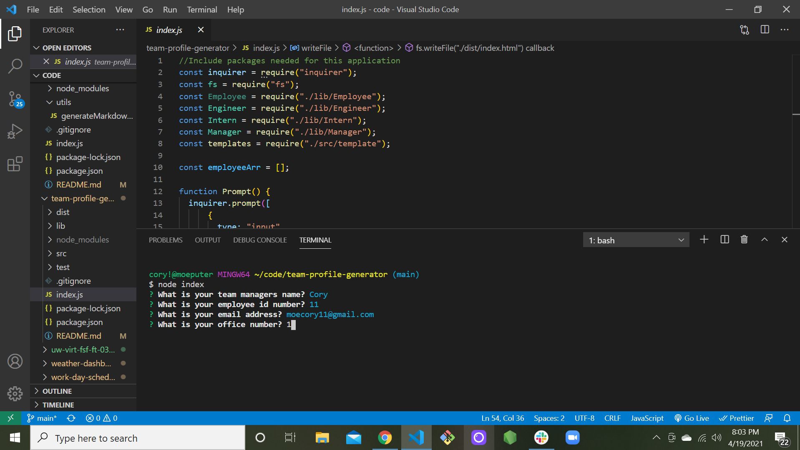
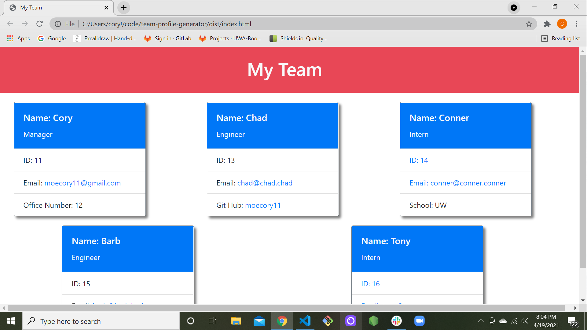

  # Team Profile Generator
  
  ## Description 
       This application allows managers to input employee data abouth their team and have a team-profile generated.
  ## Table of contents
  * [Description](#description)
  * [Installation](#installation)
  * [Usage](#usage)
  * [License](#license)
  * [Contributing](#contributing)
  * [Tests](#tests)
  * [Questions](#questions)
  ## Installation
  
          For this application you need to open the index.js file in your integrated terminal. Then enter "npm i" to install neccesary dependencies. Next, you will need to enter "node.index.js" to run application.
  ## Usage 
          Once you have installed and ran "node.index.js" in the terminal you will be prompted questions to start building your team. First, you will be asked to enter your manager information and then you will have the option to add an "Engineer", "Intern' or finsh with "build team". Once complete with all enteries choose "build team" and your profile will be created in the index.html file

  ## License
          MIT
  ## Contributing
          Myself and resources provided by Bobbi Tarkany.
  ## Tests
          n/a
  ## Questions
   Any questions regarding this application please feel free to contact me at: 
      - E-mail moecory11@gmail.com
      - Github:
      <https://github.com/moecory11>
      